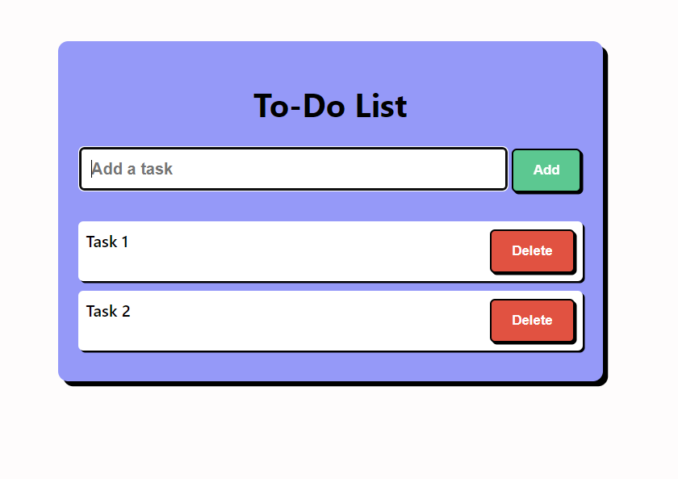

# To-Do list

## Table of Contents

- [About](#about)
- [Key Features](#key-features)
- [Technologies Used](#technologies-used)
- [Installation](#installation)
- [Usage](#usage)
- [Screenshots](#screenshots)

## About

User-friendly to-do list web application designed to simplify your task management experience. Built with HTML, CSS, and JavaScript, it offers a seamless interface for adding and deleting tasks while providing an attractive.

## Key Features

- **Seamless Task Management:** Add and delete tasks effortlessly.
- **Attractive Design:** A visually pleasing and modern interface.
- **User-Friendly Interaction:** Intuitive and easy-to-navigate layout.
- **Responsive Design:** Consistent and delightful experience on various devices.
- **Dynamic Interactivity:** Smooth task updates and interactions powered by JavaScript.

## Technologies Used

- HTML
- CSS
- JavaScript

## Installation

1. Clone the repository: `git clone https://github.com/ShivShah19/3D-To-Do-list.git`
2. Open `To-Do list.html` in your preferred web browser.

## Usage

1. Add tasks using the provided interface.
2. Delete tasks as needed.
3. Stay organized effortlessly!

## Screenshots

Developer : Shiv Shah  

Linkedin : `https://www.linkedin.com/in/shivshah19/`
